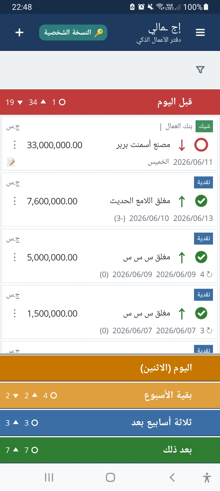
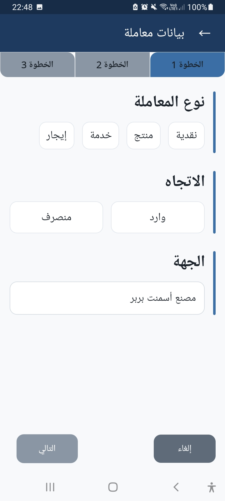
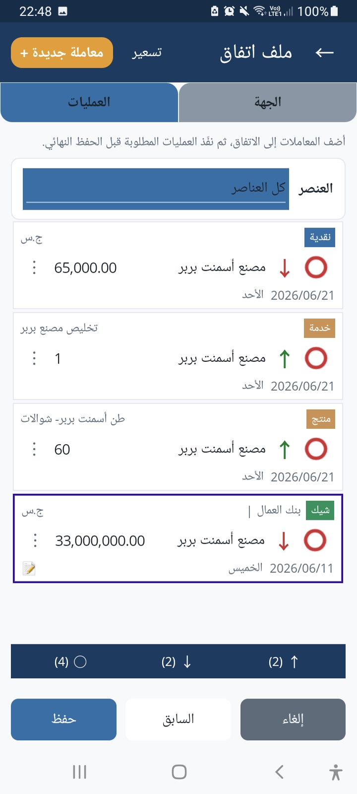
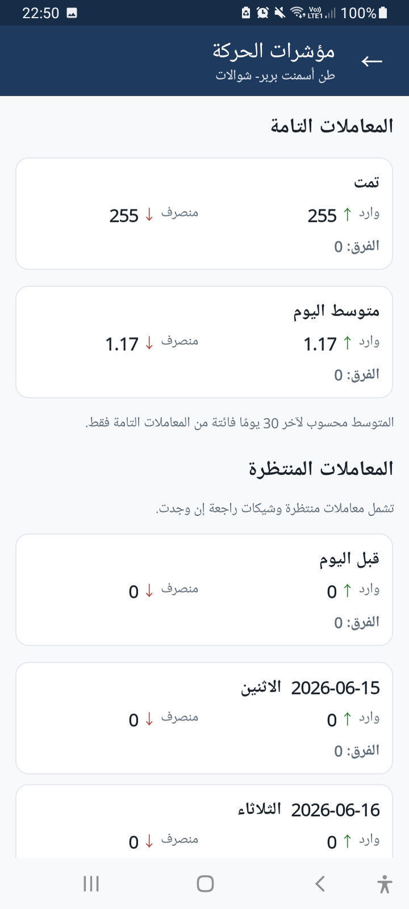
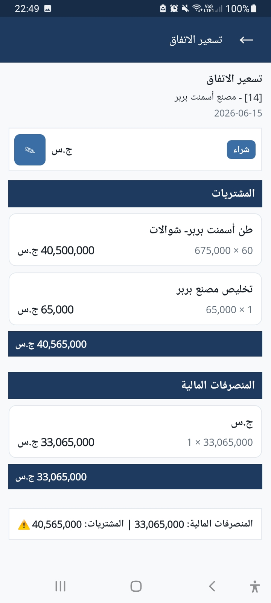
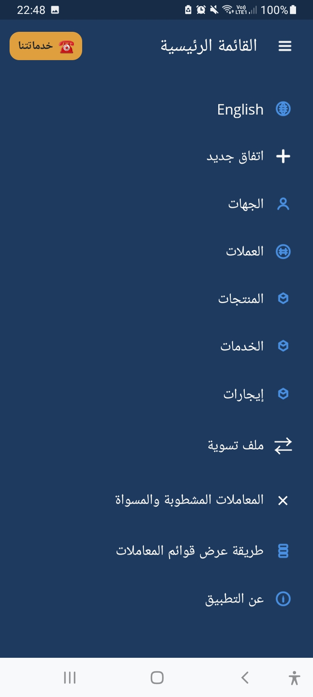

  

<h1 align="center">iGmali</h1>

  <b>Simple. Offline. Reliable.</b>

  

## العربية

تطبيق سهل لتسجيل ومتابعة حركة الأعمال من أموال ومنتجات وخدمات بينك وبين الأطراف الأخرى، مصمم للأفراد ويعمل بالكامل دون اتصال بالإنترنت.

## English

An easy app for recording and tracking business transactions involving money, products, and services between you and other parties. Designed for individuals and works completely offline.

## Features

* 💰 Money
* 📦 Products
* 🛠️ Services
* 📈 Business Movement Indicators
* 🌐 Arabic & English
* 📱 Fully Offline
* 🆓 Personal Edition

## Screenshots

| Home                 | Transaction                 |
| -------------------- | --------------------------- |
|  |  |

| Deal                 | Movement Indicators           |
| -------------------- | ----------------------------- |
|  |  |

| Pricing                 | Menu                 |
| ----------------------- | -------------------- |
|  |  |

---

© iGmali
